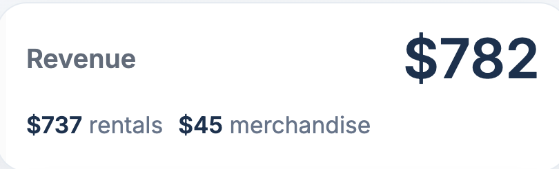
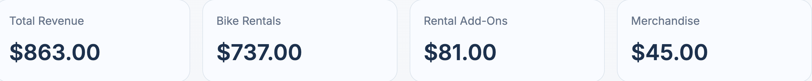

# BUG-004: Dashboard Revenue Total Does Not Match Revenue Breakdown

## Status

Open

## Severity

High

## Priority

High

## Environment

- macOS
- Google Chrome
- Admin Dashboard

## Module

Dashboard / Revenue Reporting

## Description

The revenue total displayed on the dashboard does not match the revenue reported on the Revenue Breakdown page.

The Revenue Breakdown page reports:

- Bike Rentals: **$737.00**
- Rental Add-Ons: **$81.00**
- Merchandise: **$45.00**
- **Total Revenue: $863.00**

However, the dashboard displays:

- Revenue: **$782.00**
- Rentals: **$737.00**
- Merchandise: **$45.00**

The dashboard total appears to exclude revenue generated from rental add-ons.

## Steps to Reproduce

1. Log into the Admin Dashboard.
2. Record the Revenue summary card total.
3. Open the Revenue Breakdown page.
4. Compare the dashboard total with the Revenue Breakdown total.

## Expected Result

The dashboard revenue should equal the total revenue shown on the Revenue Breakdown page.

For the current data:

- Bike Rentals: $737.00
- Rental Add-Ons: $81.00
- Merchandise: $45.00

**Expected Dashboard Revenue:** **$863.00**

## Actual Result

The dashboard displays **$782.00**, which excludes rental add-on revenue.

## Impact

- Dashboard financial metrics are inaccurate.
- Revenue totals are inconsistent between pages.
- Administrators may underestimate total revenue when viewing the dashboard.

## Suggested Fix

Update the dashboard revenue calculation to include all revenue categories displayed on the Revenue Breakdown page, including rental add-ons.

## Screenshots

### Dashboard

### Revenue Breakdown

